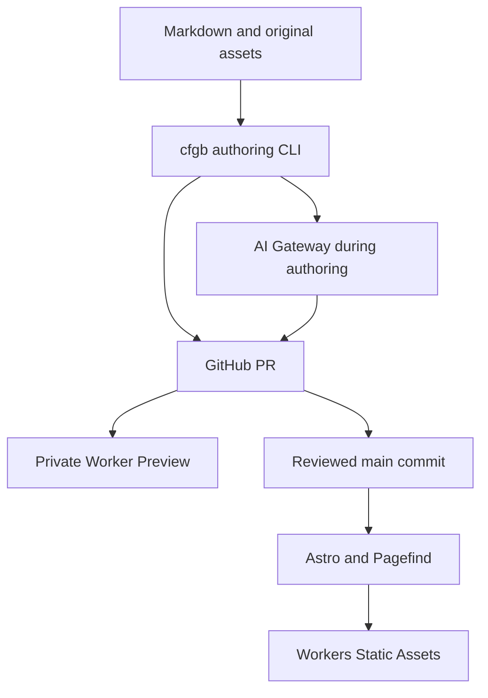

# CFGB v1 architecture

Status: implementation baseline, 2026-10-03. Normative words MUST/SHOULD describe
the intended implementation, not features already delivered in this repository.

## Ownership and boundaries

| Repository | Responsibility |
| --- | --- |
| `ymmt2005/cfgb` (tool repository) | Go CLI, schemas, embedded prompts, import/validation/AI libraries |
| `ymmt2005/cfgb-example` | Synthetic sample content and acceptance contract; later an example site |
| `ymmt2005/ymmt2005.dev` (intended site repository) | Personal content, Astro renderer, Worker and deployment configuration |

The personal site repository is a design target; its existence is not required
to use the example corpus. The Go CLI discovers `cfgb.yaml` and does not import
site-specific TypeScript. Rendering belongs to the site. Shared schemas are versioned in CFGB; the example repository links to their
canonical definitions. Schema changes must review the example fixtures too. No runtime database, CMS, accounts, comments, newsletter,
recommendations, R2, scheduling, or visitor-triggered AI in v1.

Git stores content; Astro renders; Cloudflare serves; Pagefind searches. AI
assists authors only. Cloudflare is the default hosting/gateway integration;
parsing, migration planning and validation do not require a Cloudflare account.

## Settled decisions

- Canonical personal origin: `https://ymmt2005.dev`, with a trailing slash on
  content routes. `www.ymmt2005.dev` redirects to the apex at the zone/host layer.
- Go CLI: `cfgb`; configuration: `cfgb.yaml`; generated provenance: `.cfgb.json`.
- Astro 6 is the selected major baseline; select compatible maintained patch
  versions at implementation time, pin packages and commit `pnpm-lock.yaml`.
- Original images live beside articles. Git branches/PRs are drafts; `main`
  contains published content. No `draft`, `lang`, `id`, or translation ID fields.
- An article directory groups locale variants; slugs and publication dates may
  differ by locale. Directory year is organizational, never part of public URLs.
- Topics are shared IDs with localized labels; no separate tags.
- Markdown is GFM plus footnotes, GitHub alerts, Mermaid and reviewed raw HTML.
- Expressive Code + Shiki for code, Pagefind Extended for locale-specific search.
- Light/dark/system themes, system fonts, no UI framework, local JS bundles.
- Summaries are reviewed Git content; models remain unselected until evaluation.

## Clarifications needed for an implementable contract

1. `validate --authoring` permits an absent summary before generation; regular
   `validate` requires it. `--publish` additionally rejects future dates. A
   pipeline must not reject a new article before its summary job can run.
2. A public repository exposes PR source even if preview URLs require sign-in.
   Private previews protect rendered access, not public Git content.
3. Static Assets alone cannot negotiate `Accept-Language`. A small Worker handles
   `/`, missing paths, and explicit locale preference changes; articles remain
   pre-rendered files. No visitor AI or application database is introduced.
4. Root locale redirects are temporary and non-cacheable. Article canonical URLs
   always use configured origin, never an incoming Host header.
5. AI ownership is checked before staleness. A human-edited summary must survive
   body edits, model upgrades, retries and importer reruns.
6. Only title/body are summary input in v1; input hashing is precisely defined.
7. Hatena exports can be Markdown, HTML or Hatena syntax. Non-Markdown input
   requires a conversion report and review, not silent reclassification.
8. Main builds need network for dependency installation/deployment, but never
   fetch article content, metadata, remote images or AI-generated text.

## Implementation sequence

| Phase | Deliverable | Exit gate |
| --- | --- | --- |
| 1 | Astro locale routes and renderer | Positive corpus renders correctly, including no-JS fallback |
| 2 | Pagefind, Worker and private previews | Search corpus passes; anonymous preview access blocked |
| 3 | Go authoring and validation | Schemas, diagnostics, link cards and editor paste contracts pass |
| 4 | AI adapter and ownership | All state transitions pass; blind evaluation approved |
| 5 | Hatena importer | Two-source inventory and restart/conflict tests pass |
| 6 | Personal cutover | Real corpus checks, canonical/feeds/redirects and visual review |

See [acceptance](07-acceptance.md) for the complete traceability matrix. The
synthetic search corpus is a starting point; real imported articles remain a
mandatory gate before adopting Pagefind for production.
