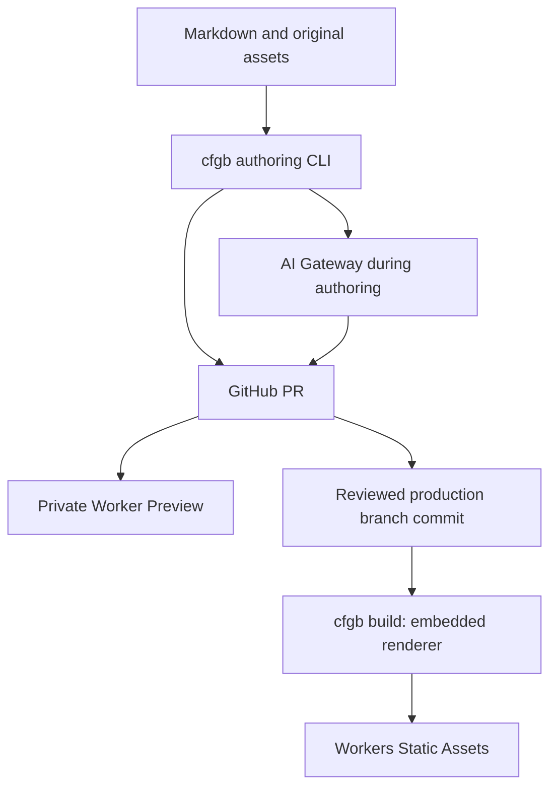

# CFGB v1 architecture

Status: implementation baseline, 2026-10-03. Normative words MUST/SHOULD describe
the intended implementation, not features already delivered in this repository.

## Ownership and boundaries

| Repository | Responsibility |
| --- | --- |
| `ymmt2005/cfgb` (tool repository) | Go CLI, embedded renderer/Worker sources, dependency lockfile, schemas, prompts, migration/AI and build/deployment adapters |
| `ymmt2005/cfgb-action` | One public setup Action: verified CLI installation, cache/PATH handling, setup outputs and Action tests |
| `ymmt2005/cfgb-example` | Synthetic article sources, assets, blog configuration and acceptance fixtures |
| `ymmt2005/ymmt2005.dev` (intended content repository) | Personal article sources, assets and blog configuration |

The personal site repository is a design target; its existence is not required
to use the example corpus. The Go CLI discovers `cfgb.yaml`; article repositories
contain no Astro source/configuration, package.json, lockfile or Worker code.
CFGB owns rendering and delivery. Shared schemas are versioned in CFGB; the example
repository links to their canonical definitions. Schema changes must review the
example fixtures too. No runtime database, CMS, accounts, comments, newsletter,
recommendations, R2, scheduling, or visitor-triggered AI in v1.

Renderer, Worker, package manifest, dependency lockfile and build checks live in
CFGB and are embedded in the released Go executable. Builds extract them into a
disposable workspace and stage a snapshot of configured content without modifying
its repository. Node.js and npm remain build prerequisites. pnpm is optional
and is selected with `CFGB_PACKAGE_MANAGER=pnpm`. Embedding sources does not
embed a JS runtime or node_modules.
Dependency installation may use network; rendering and artifact tests must work
offline. Renderer implementation and dependencies can change without adding files
to article repositories. A release records its embedded renderer version and publishes/embeds Node range,
npm >= 12, the optional exact pnpm pin, Wrangler, the tested Workers compatibility date and lockfile requirements.
Retain each external toolchain
workspace through its upload command. Workers Builds bootstraps the exact binary
under HOME and obtains provenance from official CI variables; see the
[build runtime contract](10-build-runtime.md).

The public interface is `cfgb build`, `cfgb deploy` and `cfgb preview`. Builds
create artifacts, never deploy them. Upload commands consume the same verified
artifact and do not rebuild. The artifact manifest, hashes and source/session
checks are deployment-correctness and reproducibility guards, not a cryptographic
trust boundary for transferred site artifacts. CFGB v1 assumes CI artifact
storage/transfer and the deployment environment are operator-trusted. This is
separate from supply-chain verification of CFGB executable releases and from the
PR/credential trust boundaries. See [delivery](04-delivery.md) and the
[build runtime contract](10-build-runtime.md).

GitHub automation uses `ymmt2005/cfgb-action` to install and verify the selected
CLI release and register it on PATH. Workflow `run` steps execute CFGB commands
directly. Action and CLI releases are separately pinned. Future GitHub-specific
capabilities, if needed, stay in the same public Action repository and entry point.
Workers Builds invokes the CLI directly, without requiring the Action.
See the [setup Action contract](09-github-action.md).

Git stores content; Astro renders; Cloudflare serves; Pagefind searches. AI
assists authors only. Cloudflare is the default hosting/gateway integration;
parsing, migration planning and validation do not require a Cloudflare account.

## Settled decisions

- Canonical personal origin: `https://ymmt2005.dev`, with a trailing slash on
  content routes. `www.ymmt2005.dev` redirects to the apex at the zone/host layer.
- Go CLI: `cfgb`; configuration: `cfgb.yaml`; generated provenance: `.cfgb.json`.
- Astro 6 is the selected major baseline; select compatible maintained patch
  versions at implementation time, pin packages and commit `package-lock.json` in CFGB.
  `pnpm-lock.yaml` stays in CFGB for `CFGB_PACKAGE_MANAGER=pnpm`.
  Worker Previews requires Wrangler 4.135.0+; pin one tested version in CFGB.
- Original images live beside articles. Git branches/PRs are drafts; the configured
  `deploy.productionBranch` (default `main`) contains published content. No `draft`,
  `lang`, `id`, or translation ID fields.
- An article directory groups locale variants; slugs and publication dates may
  differ by locale. Directory year is organizational, never part of public URLs.
- Topics are shared IDs with localized labels; no separate tags.
- Markdown is GFM plus footnotes, GitHub alerts, Mermaid and reviewed raw HTML.
- Expressive Code + Shiki for code, Pagefind Extended for locale-specific search.
- Light/dark/system themes, system fonts, no UI framework, local JS bundles.
- The color palette is specified only in `cfgb.yaml`. Visitors do not switch palettes.
- Summaries are reviewed Git content; models remain unselected until evaluation.

## Required implementation invariants

1. `validate --authoring` permits an absent, empty or whitespace-only summary
   before generation; regular `validate` requires a nonempty summary.
   `--publish` additionally rejects future dates. A
   pipeline must not reject a new article before its summary job can run.
2. A public repository exposes PR source even if preview URLs require sign-in.
   Private previews protect rendered access, not public Git content.
3. A small Worker handles `/` and explicit locale preference changes at
   `/__locale`. Other requests use Static Assets, including nearest-directory
   localized 404 pages. If an asset miss invokes the Worker, it delegates to
   `ASSETS.fetch`; it does not select a fallback itself.
4. Root locale redirects are temporary and non-cacheable. Article canonical URLs
   always use configured origin, never an incoming Host header.
5. AI ownership is checked before staleness. A human-edited summary must survive
   body edits, model upgrades, retries and importer reruns.
6. Only title/body are summary input in v1; input hashing is precisely defined.
7. Hatena exports can be Markdown, HTML or Hatena syntax. Non-Markdown input
   requires a conversion report and review, not silent reclassification.
8. Production builds need network for dependency installation/deployment, but never
   fetch article content, metadata, remote images or AI-generated text.
9. Direct pushes to a content repository connected to Workers Builds are limited
   to trusted maintainers and scoped generation bots. External changes arrive as
   fork PRs; they do not automatically receive credentialed builds or previews.
10. Preview protection defaults to Worker-level `preview_worker` Access, verified
    before upload even before any Preview URL exists; hostname policies are advanced.
11. Migration manifests record successful applications only. Source/target hash
    pairs stay unchanged on conflict; separate reports contain observations.

## Implementation sequence

| Phase | Deliverable | Exit gate |
| --- | --- | --- |
| 1 | Embedded renderer and `cfgb build` in CFGB | Corpus renders without framework files in article repositories |
| 2 | Search, Worker and deploy/preview adapters in CFGB | Search corpus passes; anonymous preview access blocked |
| 3 | Go authoring/validation and the setup Action | Schemas, diagnostics, link cards and editor paste contracts pass |
| 4 | AI adapter and ownership | All state transitions pass; blind evaluation approved |
| 5 | Hatena importer | Configured-source inventory and restart/conflict tests pass |
| 6 | Personal cutover | Real corpus checks, canonical/feeds/redirects and visual review |

See [acceptance](07-acceptance.md) for the complete traceability matrix. The
synthetic search corpus is a starting point; real imported articles remain a
mandatory gate before adopting Pagefind for production.
